# Windows Server Active Directory Lab

## Descripción del proyecto
Este laboratorio simula la infraestructura básica de una empresa utilizando Windows Server y Active Directory.  
Se ha implementado un controlador de dominio, unidades organizativas, usuarios, grupos de seguridad y un servidor de archivos con permisos NTFS por departamentos.  

El objetivo del proyecto es recrear un entorno empresarial real donde cada usuario tiene acceso únicamente a los recursos de su departamento.

---

## Tecnologías utilizadas

* Windows Server
* Active Directory Domain Services
* DNS Server
* PowerShell
* Windows 10/11 cliente
* NTFS Permissions
* File Server

---

## Estructura del dominio

Se ha creado el dominio:

```
empresa.local
```

Estructura de Unidades Organizativas:

```
empresa.local
└── Empresa
    ├── Ventas
    ├── IT
    └── Direccion
```

---

## Usuarios creados

| Usuario | Departamento |
| ------- | ------------ |
| juan    | Ventas       |
| ana     | Ventas       |
| pedro   | IT           |
| laura   | IT           |
| jefe    | Direccion    |

---

## Grupos de seguridad

| Grupo         | Departamento |
| ------------- | ------------ |
| GRP_Ventas    | Ventas       |
| GRP_IT        | IT           |
| GRP_Direccion | Direccion    |

Los usuarios se han añadido a sus respectivos grupos para la gestión de permisos.

---

## Servidor de archivos

Se ha creado un servidor de archivos con la siguiente estructura:

```
C:\Empresa
    ├── Ventas
    ├── IT
    └── Direccion
```

Recurso compartido:

```
\\SERVER-AD\Empresa
```

---

## Permisos NTFS

| Carpeta   | Grupo con acceso |
| --------- | ---------------- |
| Ventas    | GRP_Ventas       |
| IT        | GRP_IT           |
| Direccion | GRP_Direccion    |

La carpeta principal **Empresa** tiene permisos de lectura para *Domain Users* y cada subcarpeta tiene permisos de modificación solo para su grupo correspondiente.

---

## Cliente unido al dominio

Un equipo cliente Windows se ha unido al dominio **empresa.local** y se ha comprobado el inicio de sesión con usuarios del dominio.

Comprobación en CMD:

```
whoami
empresa\juan
```

---

## Comandos PowerShell utilizados

Listar usuarios:

```
Get-ADUser -Filter *
```

Listar grupos:

```
Get-ADGroup -Filter *
```

Ver miembros de un grupo:

```
Get-ADGroupMember GRP_Ventas
```

---

## Pruebas de acceso

Se han realizado pruebas de acceso al servidor de archivos:

| Usuario | Ventas | IT | Direccion |
| ------- | ------ | -- | --------- |
| juan    | ✔      | ✘  | ✘         |
| pedro   | ✘      | ✔  | ✘         |
| jefe    | ✘      | ✘  | ✔         |

---

## Capturas del proyecto

### Configuración del servidor
Configuración inicial del servidor, IP estática y nombre del equipo.

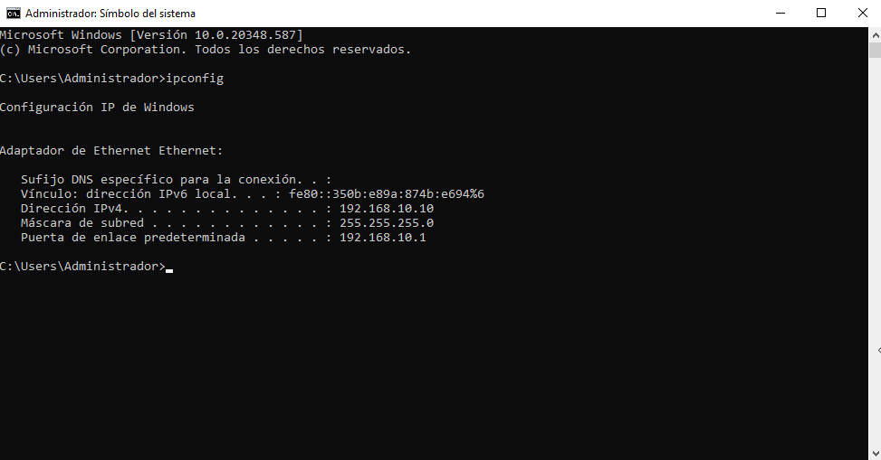

---

### Instalación de Active Directory
Instalación de los roles de Active Directory y creación del dominio.

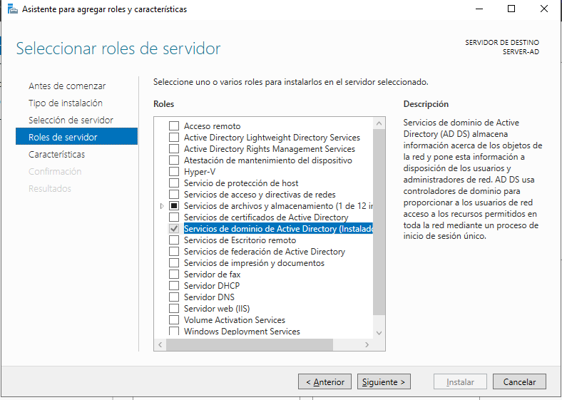


---

### Estructura de Active Directory
Unidades organizativas, usuarios y grupos creados en el dominio.

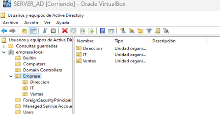
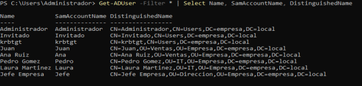
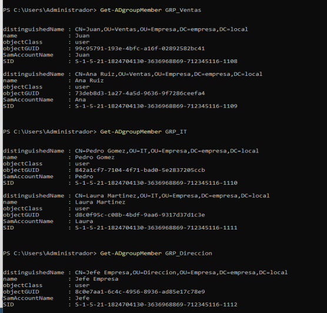

---

### Servidor de archivos y permisos NTFS
Configuración de carpetas compartidas y permisos por departamentos.

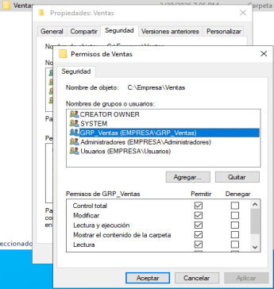
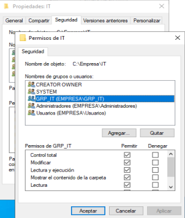
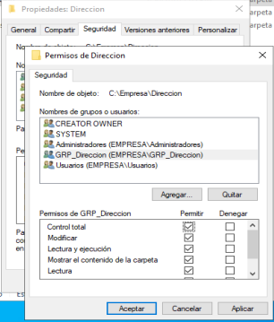

---

### Cliente unido al dominio
Equipo cliente unido al dominio e inicio de sesión con usuario del dominio.

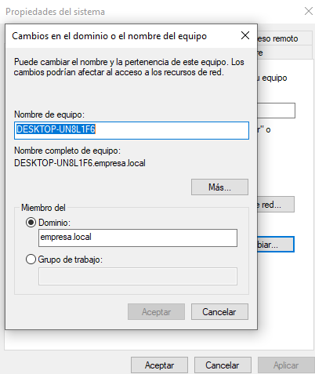
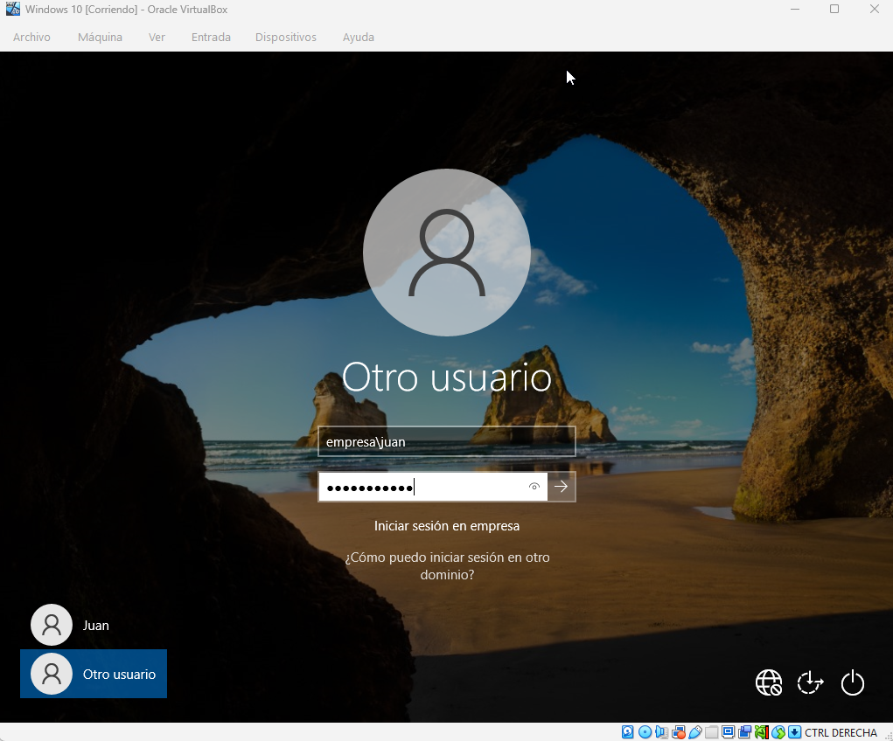
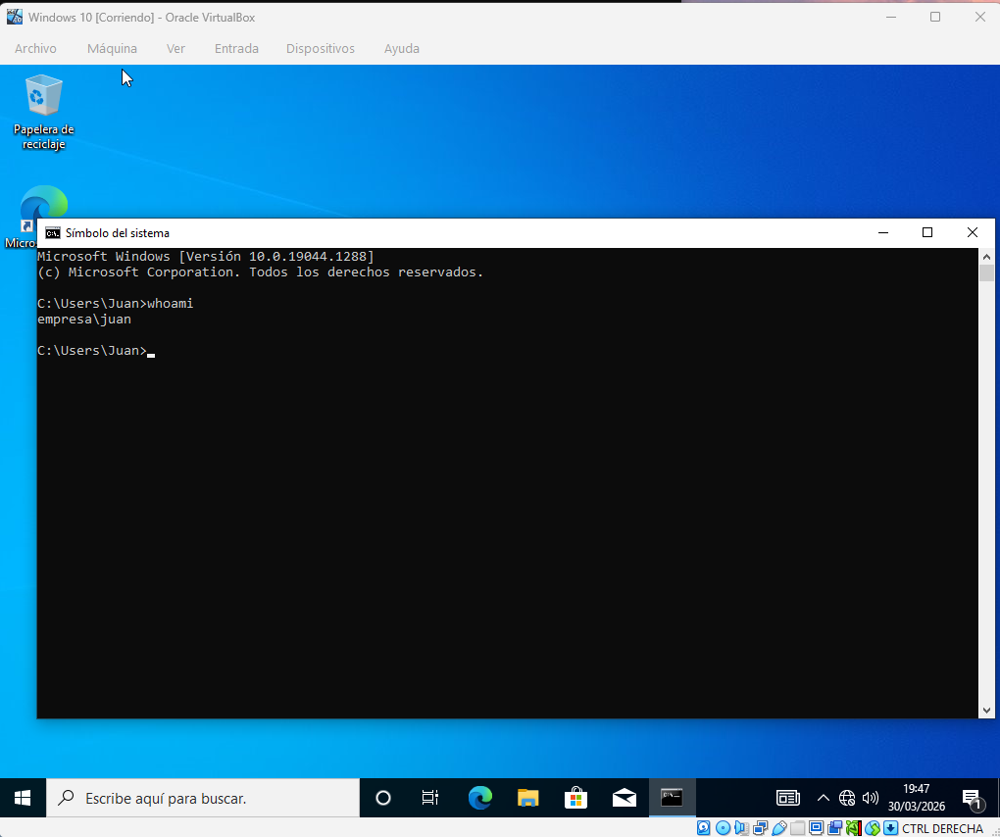

---

### Pruebas de acceso a carpetas compartidas
Acceso permitido a la carpeta del departamento correspondiente y acceso denegado a otros departamentos.

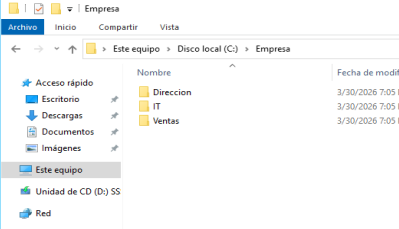
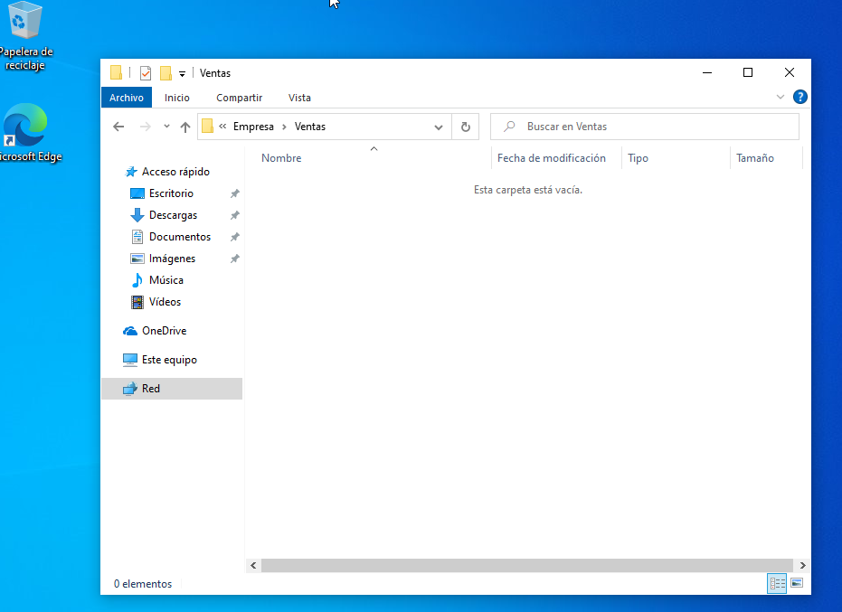
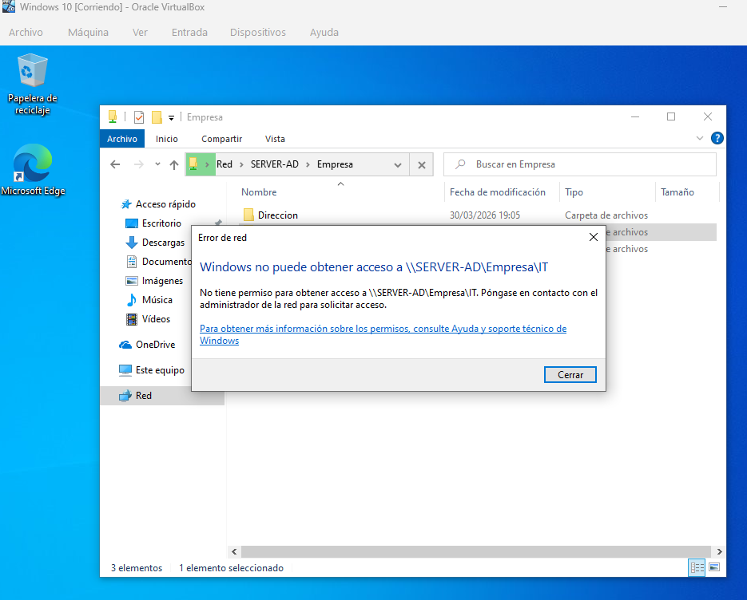


## Autor

Lorenzo León
Proyecto de laboratorio de administración de sistemas con Windows Server y Active Directory.
